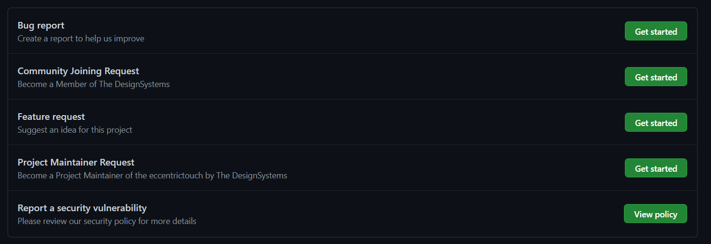
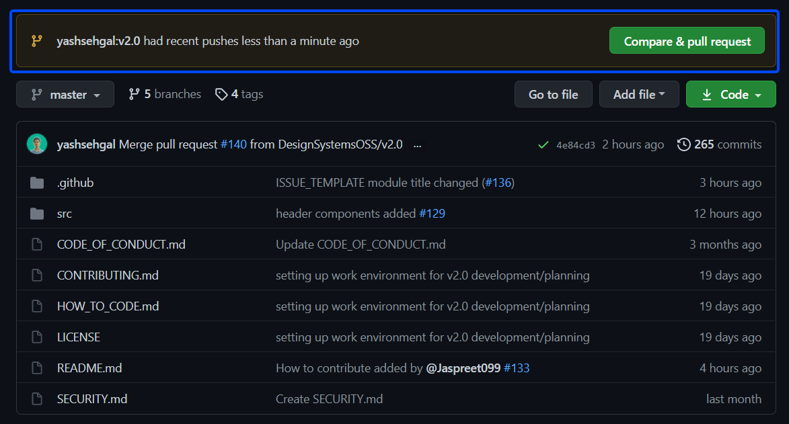
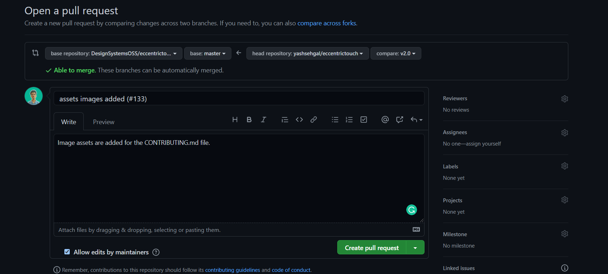
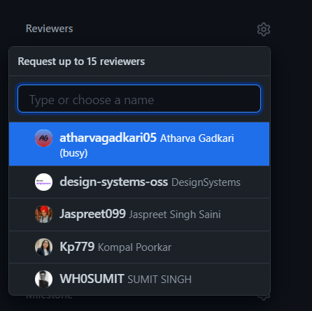
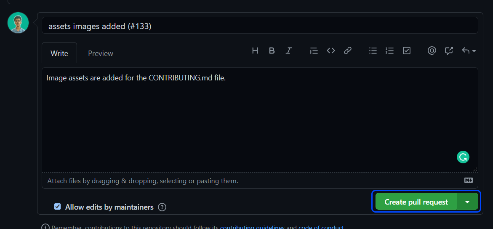

# Contributing to Eccentric Touch by The DesignSystems Community

> Welcome Note
First of all, We are happy to have you here as a Contributor. You contribution and collboration really matters. Share your ideas with other and also get those green-squares on your GitHub profile.


## How to start contributing?

### Step 01: Fork this project
In order to contribute, your first step is to fork this project. Creating a fork will make a copy of this project to your GitHub account.

Just go to the main page of this project and click the `fork` button at the top-right section.


### Step 02: Clone the forked repository to your system
Now you need to clone the forked repository to your system and then all the code/docs changes that you'll make, will be in the cloned repository only.

1. Open your terminal (Command Prompt, Git Bash, Powershell)
2. Go to the directory where you want to clone your project. For example, Let's say you have a folder named as `opensource` at the Desktop where you want to clone your project then your command prompt path should look like this.

**For Windows:**
```cmd
C:\user\Desktop\opensource>
```

**For Mac (Terminal):**
```cmd
username's-Mac:~desktop/opensource$
```

**then write the command given below:**
```cmd
git clone https://github.com/<github-username>/eccentrictouch.git
```

then `cd` to the project by writing
```cmd
cd eccentrictouch
```

Congratulations! All the setup related things are done now you can go further :)

### Step 03: Issue related Things


**If you are Raising an Issue**

Raising issues really helps this project to grow more and have great usability. There are some type of issues which are listed in the screenshot below.



All the issues have pre-designed content template. If you have selected `Bug Report` issue type then precisely explain your report or the issue you have faced. Try adding screenshots (if possible) for more clarification. 

If you have selected `Feature Request` then explain the feature in description like how it will be implemented, why it is required and if you want to work on that issue then write an assignment request also that you want to work on it. May be as a comment or in the issue itself and we'll get back to your request and start the discussion.


Other than these, you have you have community joining related issue also such as `Community Joining Request` and `Project Maintainer Request`

You can raise an issue in order to join the community on GitHub and Discord. We could have directly shared the discord server link with you but it has expiry issues. But whenever you'll raise the joining issue, our team will get back to you. Also, you can be an active member at The DesignSystems Community on GitHub and have a logo under your profile - The mark of working/contributing at The DesignSystems projects.

You can raise an issue also to become a Project Maintainer at The DesignSystems Community. Just raise your request and we'll get back to you and have a discussion. Easy right!?

**If you are solving an issue**

That's great that you want to work on an issue. All the issue are listed at the issue tab-section with proper titles, labels and assignments. Just open the issue you want to work on and request an assignment in the comments section.

Feel comfortable to ask your doubts related to that issue. Ask everything, whatever is in your mind, we are there to help you out.

### Step 04: Coding, Making the Code Changes

If you are doing code changes then make sure that your branch is v2.0
To switch from `master` branch to `v2.0`, you need to write.

```cmd
git checkout v2.0
```

Time for the real-work, Open your code editor and start working on that issue. Thoroughly go to the file structure of the project. When you are done with the changes, it's time to create a Pull Request.

### Step 05: Creating a Pull Request 

Go to your terminal again, and write the commands mentioned below.

**1. First you need to add your changes to the Staging area.**

```cmd
git add <FILENAME_WHERE_YOUR_CODE_CHANGES_ARE>
```

If you want to add everything at the time then just write
```cmd
git add .
```

But for a good-developer practice always add files according to the types of changes made.

**2. Commit your code changes with a short(informative) message**

```cmd
git commit -m "<A SHORT MESSAGE/LINE EXPLAINING YOUR CODE CHANGES> <ISSUE_TAG_IF_POSSIBLE>"
```

for an example, you have changed the CSS Properties for the Header and the issue-tag was #123 then the proper way to commit your code changes would be.

```cmd
git commit -m "CSS Properties for Header changed (#123)"
```

And your changes are committed!

**3. Push your Code Changes**

```cmd
git push -u origin v2.0
```
Make sure that you have done your code changes on the v2.0 branch and push on the same branch - The v2.0 branch.

Voila! Your code changes are pushed to your forked repository.
Time to create a PR!! :star:

**4. Go to your forked Repository**

When you will go to your forked repository, You will see a message/notification like this.



Click of the Green Coloured `Compare & Pull Request Button`

Now after clicking the button you need to write a short but informative message in order to support your changes. For example, The one given below




Also, Don't forget to request a review from our project maintainers. Select to at least 1-2 project maintainers to review your Pull Request. Just like this.



All set! Submit your PR. Click the `Create Pull Request` button.



Then wait for the checks, and the discuss the stuff if required with our project maintainers and after all the checks we'll merge your Pull Request. :smiley:

## How to write code?

As this is a CSS Library, there's a whole lot of CSS Properties, Methods which are being written. While coding and making some code changes these best practices should be in your mind.

1. Redundancy: We need to write a good CSS code which is easy to understand and is less redundant. If there's a class-property which is being implemented then don't re-implement that property in a new class.

2. Coding in the same part: This is a very basic thing but is very helpful for all of us. If you are making any code change or changing any code block then make sure you code around the similar CSS Properties.
Let' say, you are adding CSS for header responsiveness then make sure you code this feature near other header CSS code. This makes easier to find a particular code block.

3. In Eccentric Touch, we use a unique method to write classes. Every class that you are writing, it should have a prefix of `et`. For an example, you are implementing a header component in CSS, The class-name should be `et-header`, which makes it unique from other CSS Libraries and prevents un-necessary conflicts.

4. Cross-Browser Compatibility: When you use an external stylesheet (where we can use browser engine prefix like -moz-, -webkit-, -o- and -ms-) for layout and valid markup (XHTML, HTML5), then your web pages work well on all browsers such as IE, Opera, Chrome, Mozilla, and Safari, etc..

